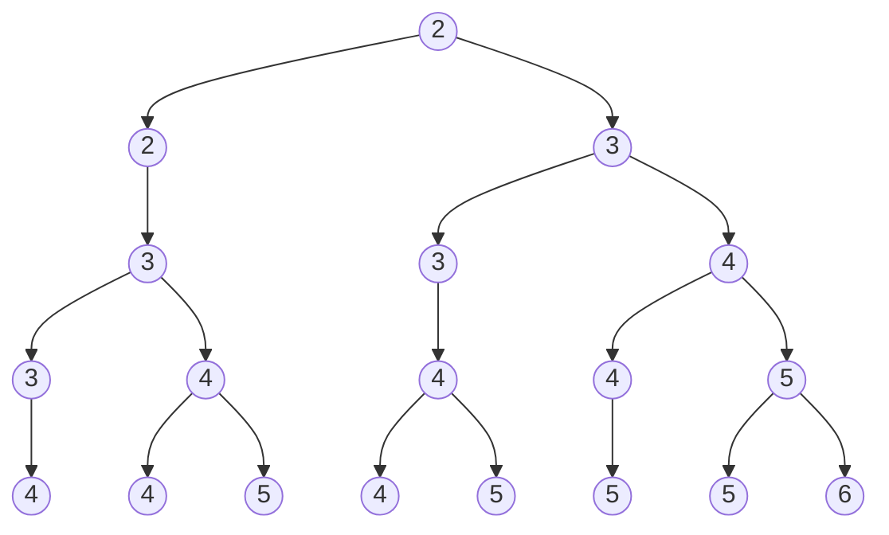

- 相异元素不允许重复
	- $P(n, r)$ （线排列）
		$S = \{1·e_{1}, 1·e_{2},\dots, 1·e_{n}\}$
		$\iff$ $RP(n, r), n_{i}=1$
	- $C(n, r)$
		- 不可重组合：$1 \le b_1 < b_2 < \cdots < b_r \le N$
		
	- $CP(n,r)=\frac{P(n,r)}{r}$ （圆排列）
		- 可重：Möbius inversion
	- $\frac{CP(n,r)}{2}$ 项链排列（类似手性）
	- $RP(∞, r) = n^r$ **r 个“有编号”的球**进 **n 个有编号的盒子**（**不考虑**盒内顺序）
		$S = \{∞\cdot e_{1}, ∞\cdot e_{2},\dots, ∞\cdot e_{n}\}$
		$\iff$ $RP(n, r), n_{i}=∞$
		![[Generating Function#r 无限可重排列：]]
		- [[Permutations and Combinations#例2.5.4 相异物体 -> 不同盒子]]
			**r 个“有编号”的球**进 **n 个有编号的盒子**（**考虑**盒内顺序）

	- $RC(∞, r) = C(n+r-1, r)$ **r 个“不可区分”的球**进 **n 个有编号的盒子**（**不考虑**盒内顺序）
		- **可重组合**：$1 \le a_1 \le a_2 \le \cdots \le a_r \le n$
		-  $b_i = a_i + (i - 1)$ 弱不等式 $\iff$ 强不等式
		![[Generating Function#r 无限可重组合：]]
		- 隔板法/stars and bars
$$(1+1+\dots+1)^r=n^r = \sum_{|α|=r}\frac{r!}{α!}·1^{α}$$
$$
\boxed{
n^r=\sum_{j_1+\cdots+j_n=r}\frac{r!}{j_1!\cdots j_n!}
}
\qquad\text{而}\qquad
\boxed{
\binom{n+r-1}{r}=\sum_{j_1+\cdots+j_n=r}1
}
$$
		- So $n^r$ is literally a sum of $\binom{n+r-1}{r}$ multinomial coefficients (one per multiset / multiplicity pattern).
$$
\begin{cases}
x_{i}\geq0 \\
x_{1}+x_{2}+\dots+x_{n}=r
\end{cases}
$$
![[Permutations and Combinations#16. 整数有序分拆]] 

- 不尽相异元素的全排列（不好算吗）
	- $RP(n, r)$
		$S = \{n_{1}\cdot e_{1}, n_{2}\cdot e_{2},\dots, n_{t}\cdot e_{t}\}$，$n_{1}+n_{2}+\dots+n_{t}=n$ （均非负）
		- $r=1$, $RP(n,1)=t$
		- $r=n$, 不同元素的全排列 $\frac{n!}{n_{1}!n_{2}!\dots n_{t}!}$
			- $r=n$, $t=2$,  $\frac{n!}{n_{1}!n_{2}!}$

- 不尽相异元素的组合
	- $RC(n,r)$
		$S = \{n_{1}\cdot e_{1}, n_{2}\cdot e_{2},\dots, n_{t}\cdot e_{t}\}$，$n_{1}+n_{2}+\dots+n_{t}=n$ （均非负）
$$
G(x)=[x^r]\prod_{i=1}^t(1+x+x^2+\cdots+x^{n_i})
$$
$[x^r]$ 表示 取 $x^r$ 系数

#### 组合恒等式

$$
\binom{n}{r}=\binom{n}{n-r}
$$
$$
\binom{n}{r}=\binom{n-1}{r}+\binom{n-1}{r-1}\iff\binom{m+n}{r}=\binom{m+n-1}{m}+\binom{m+n-1}{r}
$$
朱世杰恒等式：
$$
\binom{n+1}{r+1}=\sum_{i=r}^n\binom{i}{r}\iff\binom{n}{r}=\sum_{i=r-1}^{n-1}\binom{i}{r-1}
$$
Vandermonde Identity: （算两次）
$$
{m+n \choose r} = \sum_{k=0}^r{m \choose k}{n \choose r-k}
$$
$$
\sum_{i=0}^{n}\binom{n}{i}=2^n
$$
$$
[1+(-1)]^n={n\choose 0}-{n\choose 1}+{n\choose 2}-\dots+(-1)^n{n\choose n}=0
$$
变系数平方求和
$$
\begin{align}
\sum_{i=0}^{n}k·{n\choose k}^2&={n\choose 1}^2+2·{n\choose 2}^2+n·{n\choose n}^2=n·{2n-1\choose n-1} \\
{n\choose k} = \frac{n}{k}{n-1 \choose k-1}&\implies
\sum_{i=0}^{n}k·{n\choose k}^2 \\
&=n\sum_{i=0}^{n}{n-1\choose k-1}{n\choose k} \\
&=n\sum_{i=0}^{n}{n-1\choose k-1}{n\choose n-k} \text{(Note that }(n-k)+(k-1)=n-1\text{)} \\
&=n{2n-1\choose n-1}
\end{align}
$$
概率恒等式
$$
\frac{r}{m}+\frac{M-r}{M}·\frac{r}{M}+\frac{M-r}{M}·\frac{M-r-1}{M-1}·\frac{r}{M-2}+\dots=1
$$
乘法公式推广式
$$
\sum_{k=0}^{n-m}{n\choose m+k}{m+k\choose k}
$$

#### 例题

##### 例2.5.4 相异物体 -> 不同盒子

>[!faq] 相异物体 -> 不同盒子
>r个相异物体 -> n个不同盒子，每个盒子允许放任意个物体。
>（1）考虑同一盒中物体次序。
>（2）不考虑同一盒中物体次序。

（是否需要考虑 r & n 的大小关系？似乎不用，隔板法可解。）

（1）第一个：n处；第二个：n+1处；第三个：n+2处（前一个当成新隔板。。）
$$
n(n+1)(n+2)\dots(n+r-1)=\frac{(n+r-1)!}{(n-1)!}
$$
$$
\begin{align}
\sum_{|α|=r}{r \choose α}α! &= \sum_{|α|=r}r!\\
&= {r+n-1 \choose r} r! \\
&= \frac{(r+n-1)!}{(n-1)!}\\
&= P_{n+r-1}^r
\end{align}
$$
（2）
$$
\begin{align}
\sum_{|α|=r}{r \choose α} &= \sum_{|α|=r}{r \choose α} 1^α \\
&= (1+1+\dots+1)^r\\
&= n^r \\
&= RP(∞, r)
\end{align}
$$
>[!faq] 实际应用
>（1）5位同学、2个门进教室，各门每次一人。
>（2）不考虑顺序。
>（3）（拓展问题1）前门宽大，可同时进两人。

（1）5个东西、2个盒子 $P^{5}_{5+2-1}=720$
（2）5个东西、2个盒子 $2^5=32$
（3）

还是按照3个门的做法吧：
5个东西、3个盒子、考虑顺序 $P_{5+3-1}^{5}=2520$

>[!fail] 谬解
>- 前门的两人可以不考虑先后。。（暗含别的需要考虑先后，不然直接 $2^5$）
>- “可同时”：未必非得同时。（直接把问题复杂度提升了个档次。。）
>
>n=2, r = 5
>
>第一个人有2个盒子；考虑上一个人，既可以为隔板（此时有3个盒子），也可以先不作为隔板（此时有2个盒子，但由于前门只能同时容纳2人，故只能接连一次，
>
>可以以某种树的形式表示
>$$
>2×3×4×5×6+2×3×4×5×5+2×3×4×4×5+2×3×3×4×5+2×3×3×4×4+2×2×3×4×5+2×2×3×4×4+2×2×3×3×4=3024
>$$
>- **一旦配对，内部顺序要除以 2**（你树里乘法没有系统地做这个“除以 2”的折扣），
>$$
>2×3×4×5×6+2×3×4×5×5/2+2×3×4×4×5/2+2×3×3×4×5/2+2×3×3×4×4/2/2+2×2×3×4×5/2+2×2×3×4×4/2/2+2×2×3×3×4/2/2=1716
>$$
>- 还容易把同一种最终安排以不同路径重复数到（重数）。
>
>给每个“同时进前门”的对儿除以 2 只解决了 **“对内顺序”**（(a,b) 与 (b,a)），但没有解决 **“同一最终方案在你的树里能走出多条历史路径”** 的问题。

>[!faq] 拓展问题
>（2）100乘客，4门排队候车。
>（3）共19层楼，12人在1F电梯上楼，每层都可能有人出，且电梯门同时仅容一人出入，多少种出电梯方式？

（2）
不考虑顺序：$4^{100}$
考虑$P^r_{n+r-1}=\frac{(n+r-1)!}{(n-1)!}=\frac{103!}{6}$
（3）
12人->18盒子
不考虑顺序：$18^{12}$
考虑$P^r_{n+r-1}=\frac{(n+r-1)!}{(n-1)!}=\frac{29!}{17!}$

##### 例2.5.5 n元集合划分

>[!faq] n元集合划分问题
>n元集->n-3个**非空子集**
>（1）无序非空子集
>（2）有序非空子集（子集有标号）

（1）不可重、组合

- $n=(n-4)+4$
	${n\choose 4}{4\choose 4}={n\choose 4}$
- $n=(n-5)+3+2$
	${n\choose 5}{5\choose 2}{3\choose 3}=10{n\choose 5}$
- $n=(n-6)+2+2+2$
	${n\choose 6}{6\choose 2}{4\choose 2}{2\choose 2}/3!={n\choose 6}{6\choose 2}{4\choose 2}{2\choose 2}/3!=15{n\choose 6}$

（2）不可重、排列

- $n=(n-4)+4$
	${n\choose 4}{4\choose 4}(n-3)(n-3-1)!={n\choose 4}(n-3)!$
- $n=(n-5)+3+2$
	${n\choose 5}{5\choose 2}(n-3){3\choose 3}(n-4)(n-3-2)!=10{n\choose 5}(n-3)!$
- $n=(n-6)+2+2+2$
	${n\choose 6}\frac{{6\choose 2}(n-3){4\choose 2}(n-4){2\choose 2}(n-5)}{3!}(n-3-3)!=15{n\choose 6}(n-3)!$

若块大小 $s$ 出现 $m_s$ 次（包括单元素块 $s=1$），满足 $\sum_s sm_s=n$，那么对应无序划分数是：
$$
\frac{n!}{\prod_s \bigl((s!)^{m_s}m_s!\bigr)}=\frac{\binom{n}{α}}{\prod_{s}m_{s}!}
$$
- 块内不计顺序
- 互换这些**同大小的位置**不会改变“无序划分”的结果，但会在 $\binom{n}{\alpha})$ 里被当作不同的构造路径数到多次。
##### 例2.5.6 两两之差均大于 r 的 k 元子集

>[!faq] 把可重变为不可重
>$f_r(n,k)$ 为 $\{1,2,3,\dots,n\}$ 两两之差均大于 r 的 k 元子集的方案数。

$n\leq r$：0
$n>r$：
“任意两两之差都大于 $r$” 等价于（只需看相邻的）
$$
a_{i+1}-a_i \ge r+1\qquad(1\le i\le k-1)
$$
压缩（去掉强制空隙），定义
$$
b_{i} := a_{i}-(i-1)r
$$

$$
\begin{align}
1 \le a_1 < a_1 + r < a_2 < a_2 + r < \cdots < a_k \le n &\iff \\
1 \le a_1 < a_1 + r + 1\leq a_2 < a_2 + r + 1 \leq \cdots \leq a_k \le n &\implies \\
1 \le b_1 < b_2 < \cdots < b_k \le n-(k-1)r &\implies \\
\text{不可重组合：}\binom{n-(k-1)r}{k} \textbf{（不要跟可重的}C(n+r-1,r)\textbf{搞混）}
\end{align}
$$

#### 习题

##### 3. 教室入座

>[!faq] 教室入座
>教室两排，每排8个座，14名学生，按以下方式入座：
>（1）规定某5人总在前排，某4人总在后排，但每人具体座位不指定。
>（2）要求前排至少5人，后排至少4人。

（1）$A_8^5 A_8^4 A_7^5$
（2）

$$
\sum_{k=6}^8 A_{8}^k A_{8}^{14-k}
$$
以上可以发现，无论哪种坐法，实际都符合题意，故只需要选出2个空位后让他们自行排列。
$$
C_{16}^2 A_{14}^{14}
$$
其中 $C_{16}^2$ 也可为
$$
\binom{8}{2}+8\cdot 8+\binom{8}{2}=28+64+28=120
$$

>[!fail] 谬解
>$C_{14}^5 A_{8}^5 C_{9}^4 A_{8}^4 A_{7}^5$
>- 先挑出 5 个“被钉死在前排的人”（但题目没说有这 5 个特权人）并排座；
>- 再挑出 4 个“被钉死在后排的人”并排座；
>- 剩下 5 人随便塞进剩余 7 个空座。
>
>这当然会覆盖所有满足“前≥5、后≥4”的座次，但关键是——**同一个座次会对应多种(1)(2)中的“挑人方式”**，所以被数了很多遍。
>
>注意：第 1 步和第 2 步引入了两个“标签”：
>- “这 5 个”是我先挑出来的前排组
>- “这 4 个”是我后挑出来的后排组
>
>但在题目（2）里，**任何坐在前排的人都没有“先挑/后挑”的身份差别**，题目只关心坐前排/后排，不关心你在计数时把谁叫做“那 5 个”。
>
>这就是重复计数的根源：**同一个最终座次有很多种“贴标签”的方式。**
>
>现在我们固定一个最终座次（前排 $k$ 人，后排 $14−k$ 人），问：
>
>有多少种不同的第 1 步/第 2 步“挑人方式”，最终还能产生**同一个**最终座次？
>
>两步的自由度分别为：$\binom{k}{5}$、$\binom{14-k}{4}$所以**同一个最终座次**会被你的流程重复计数 $\binom{k}{5}\binom{14-k}{4}$ 次：
>
>* (k=6)：重复 $\binom{6}{5}\binom{8}{4}=6\times 70=420$ 次
>* (k=7)：重复 $\binom{7}{5}\binom{7}{4}=21\times 35=735$ 次
>* (k=8)：重复 $\binom{8}{5}\binom{6}{4}=56\times 15=840$ 次
##### 4. 时间安排

>[!faq] 时间安排
>一周，50h时间，每天至少5h。

7天兜底35h，只需考虑剩下15h的分配，分摊到7个盒子，可空，对应
$$
\binom{15+7-1}{15}=54264
$$

##### 5. 圆桌就坐

>[!faq] 圆桌就坐
>某两人拒绝相邻，12人围圆桌就坐。

把相邻的两人当一个块，此时桌上等价于 **11 个单位**（这个块 + 另外 10 人）围圆桌就坐

$A_{12}^{12}/12-A_{2}^2 A_{11}^{11}/11=11!-2\cdot 10! = 9\cdot 10! = 9\cdot3628800 = 32659200$

##### 16. 整数有序分拆

>[!faq] 相同球、不同盒子，无空盒（整数有序分拆）
>r个完全一样的球，放到n个有标志的盒子，$r\geq n$，要求无一空盒。
>注意n和r的顺序，这里对原题进行了颠倒。

$$
\begin{cases}
x_{i}\gt0 \\
x_{1}+x_{2}+\dots+x_{n}=r
\end{cases}
\iff
\begin{cases}
y_{i}+1\ge1 \text{（不要把}x_i, y_{i}\text{的地位弄反）}\\
(y_{1}+1)+(y_{2}+1)+\dots+(y_{n}+1)=r
\end{cases}
\implies {n+r-n-1 \choose r-n}={r-1 \choose n-1}
$$
